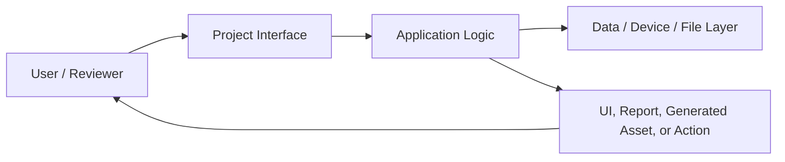
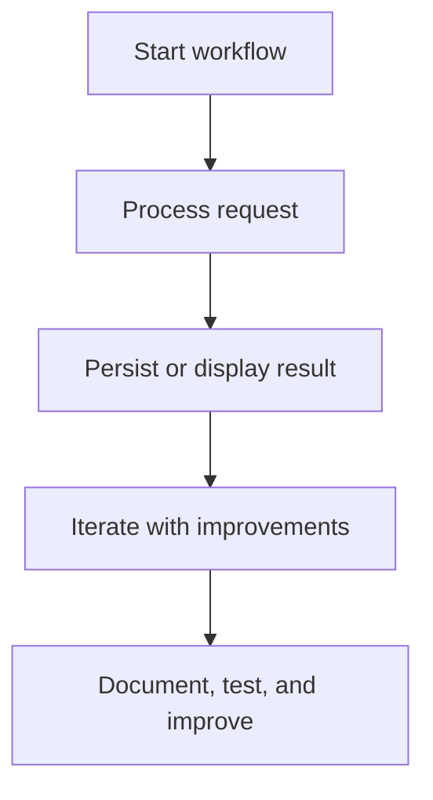
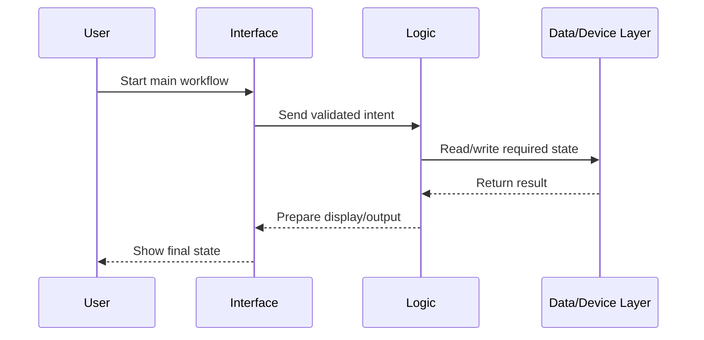

# Architecture — Web App Launchpad

## Purpose

Starter repository for building modern web applications.

This document explains the project from an engineering-review perspective: layers, workflow, data/state movement, and extension points.

## System Context

## Primary Workflow

## Layered Design

| Layer | Responsibility | Review Focus |
| --- | --- | --- |
| Interface | Screens, pages, commands, forms, or hardware entry points | Is the user flow clear and easy to demo? |
| State / Logic | Validation, calculations, orchestration, and workflow rules | Is behavior predictable and maintainable? |
| Data / Services | Local storage, API calls, generated files, device APIs, or models | Is data handled safely and consistently? |
| Presentation | README, diagrams, screenshots, and demo notes | Can someone understand the project quickly? |
| Quality | Tests, linting, review checklist, and roadmap | Can the project grow without becoming messy? |

## Technology Profile

| Category | Value |
| --- | --- |
| Primary stack | HTML |
| Repository type | Public portfolio |
| GitHub topics | css, github-pages, html, javascript, starter, webapp |

## Data / State Flow

## Extension Points

- Add screenshots or demo GIFs for the most important workflow.
- Add automated checks that match the stack.
- Add environment documentation if external services are used.
- Add test fixtures or sample data for repeatable demos.
- Convert roadmap items into small, reviewable issues.

## Engineering Review Notes

A strong reviewer should be able to answer:

1. What problem does this project solve?
2. What is the main user workflow?
3. Which files/layers own the core behavior?
4. What tradeoffs are documented?
5. What would be the next professional improvement?
